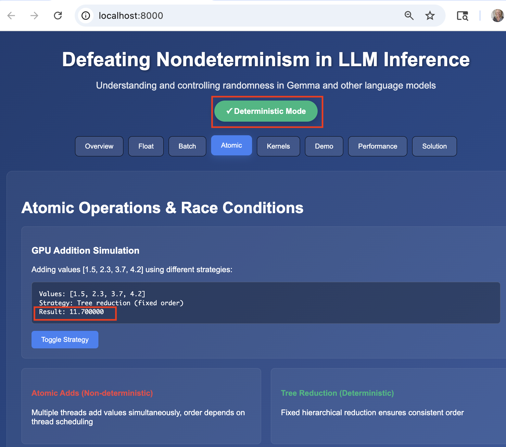
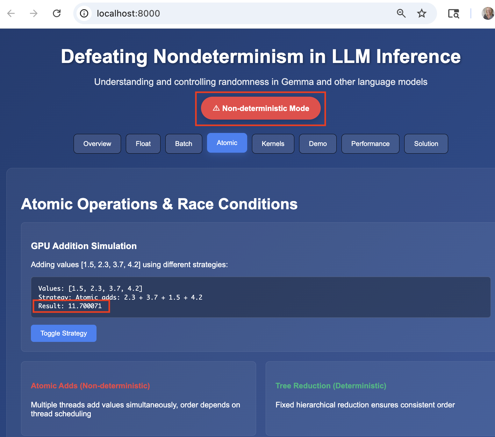

# LLM Determinism Explorer

<div align="center">
  <table>
    <tr>
      <td align="center">
        
        <br/>
        <strong>Deterministic Mode</strong>
      </td>
      <td align="center">
        
        <br/>
        <strong>Non-Deterministic Mode</strong>
      </td>
    </tr>
  </table>
</div>

An interactive React application that demonstrates and explains nondeterminism in Large Language Model (LLM) inference, based on the research ["Defeating Nondeterminism in LLM Inference"](https://thinkingmachines.ai/blog/defeating-nondeterminism-in-llm-inference/) by Thinking Machines Lab.

## Features

This single-page application explores why LLMs such as [Google's Gemma](https://deepmind.google/models/gemma/) produce different outputs even at temperature=0, and provides practical solutions for achieving determinism.

### Interactive Demonstrations

- **Overview**: Qwen-235B experiment results showing 80 unique outputs from 1000 runs
- **Float Calculator**: Interactive floating-point non-associativity demonstration
- **Batch Simulation**: How different batch sizes trigger different kernels
- **Atomic Operations**: Race conditions in GPU parallel operations
- **Kernel Solutions**: Code examples for deterministic implementations
- **Live Demo**: Gemma-2B inference simulation with copy-to-clipboard code
- **Performance Analysis**: Throughput comparisons and trade-offs
- **Implementation Guide**: Step-by-step setup instructions

### Key Features

- **Deterministic Mode Toggle**: Affects all simulations throughout the app
- **Dark Gradient Theme**: Professional blue gradient background
- **Interactive Elements**: Calculators, dropdowns, simulations with realistic delays
- **Code Examples**: Copy-to-clipboard functionality for implementation
- **Responsive Design**: Works on desktop and mobile devices

## Quick Start

1. **Clone or download** this repository
2. **Start a local HTTP server** in the project directory:
   ```bash
   python3 -m http.server 8000
   ```
3. **Open your browser** and go to `http://localhost:8000`
4. **Explore the tabs** to learn about LLM nondeterminism

Note: A local server is required to avoid CORS issues when loading the JSX component file.

## File Structure

```
LLM-determinism-app/
├── index.html              # Main HTML file with React setup
├── LLMDeterminismApp.jsx   # Complete React application
└── README.md              # This file
```

## Browser Requirements

- Modern browser with ES6+ support
- JavaScript enabled
- Network access for React CDN (or download for offline use)

## Usage

### Navigation
- Use the **tab navigation** to explore different aspects of LLM nondeterminism
- Toggle **Deterministic Mode** to see how it affects all simulations
- Click **copy buttons** to get implementation code examples

### Interactive Elements
- **Float Calculator**: Adjust values to see floating-point precision issues
- **Batch Selector**: Change batch sizes to see kernel variations
- **Kernel Dropdown**: Explore different operation types and solutions
- **Demo Runner**: Simulate Gemma-2B inference with different configurations

## Educational Content

### The Problem
- LLMs produce different outputs even at temperature=0
- Research shows 80 unique outputs from 1000 identical runs
- Three root causes: floating-point ops, batch variance, concurrency

### The Solutions
- Environment configuration for deterministic algorithms
- Model loading with appropriate data types
- Generation parameters for consistent results
- Performance trade-offs and when to use deterministic mode

## Technical Implementation

- **Single-file React component** with inline styles
- **No external CSS dependencies**
- **Uses React from CDN** with Babel for JSX transformation
- **Responsive grid layouts**
- **Color-coded status indicators**
- **Realistic simulation delays**
- **Clipboard integration**

## Performance Notes

The app demonstrates that deterministic mode typically results in:
- **30-40% throughput reduction**
- **Higher memory usage** (float32 vs float16)
- **Limited optimization** opportunities

## Research Reference

Based on "Defeating Nondeterminism in LLM Inference" research demonstrating:
- Qwen-235B nondeterminism at temperature=0
- Token 103 divergence patterns
- Practical solutions for reproducible inference

## Development

To modify the application:
1. **Start the development server**: `python3 -m http.server 8000`
2. **Edit `LLMDeterminismApp.jsx`** (uses React hooks, no ES6 imports)
3. **Refresh your browser** at `http://localhost:8000`
4. Changes will be reflected immediately

The component uses React hooks for state management and includes hover effects, animations, and interactive simulations.

### Technical Notes
- The JSX file has been modified to work with Babel standalone in the browser
- React imports have been replaced with global `React.useState` calls
- Component is exported to `window.LLMDeterminismApp` for browser compatibility

## License

This educational demonstration is provided as-is for learning purposes.
